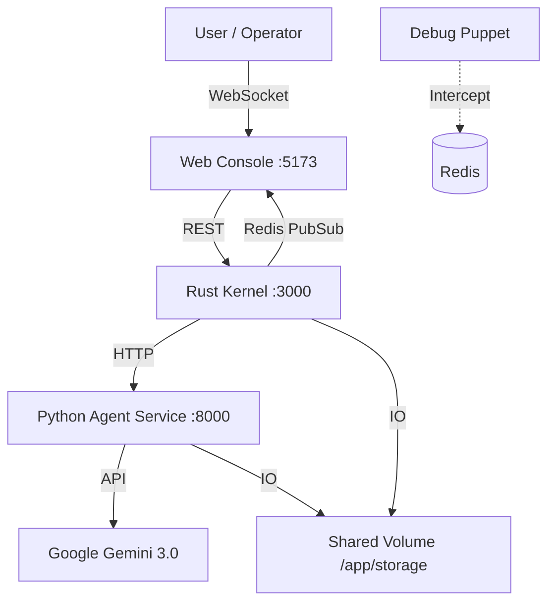

# RARO: Recursive Agentic Runtime Operator

> **"Kubernetes for Cognitive Workflows"**

  

RARO is a production-grade orchestration platform designed to transform multi-agent AI from a "black box" into a transparent, observable, and reconfigurable **Directed Acyclic Graph (DAG)**.

Unlike standard chat-based agent frameworks, RARO separates **Control Logic (Rust)** from **Inference Logic (Python)**, enabling high-performance scheduling, strict type safety, and "Human-in-the-Loop" intervention capabilities for complex research and coding tasks.

---

## 🌟 Key Capabilities

### 1. Dynamic Graph Splicing (Flow B)
Agents are not bound to a static workflow. Utilizing the **Delegation Protocol**, a running agent can request to spawn sub-agents to handle unforeseen complexity. The Rust Kernel dynamically "splices" these new nodes into the live graph, rewiring dependencies in real-time without stopping the execution.

### 2. Cortex Safety Layer (Flow C)
A dedicated event-loop within the Rust Kernel acts as a nervous system. It matches runtime events against a **Pattern Registry** (e.g., "Prevent File Deletion", "Require Approval for Root Access"). It can pause execution (`AWAITING_APPROVAL`) effectively creating a circuit breaker for AI behavior.

### 3. RFS (Raro File System)
Agents operate within secure, isolated workspaces. RFS provides a tiered storage architecture:
*   **Session Storage:** Ephemeral input/output for the active run.
*   **Artifact Storage:** Persistent storage for generated assets (images, PDFs, code).
*   **Library:** A shared, curated repository of files that can be mounted into new workflows.

### 4. "Glass Box" Observability
The **Web Console** (Svelte 5 + Runes) renders the living topology via WebSockets. It visualizes:
*   Real-time token usage and cost.
*   Thought Signatures (Context continuity hashes).
*   Tool execution traces.
*   Dynamic node injection animations.

---

## 🏗 System Architecture

The system employs a **Split-Brain Architecture** to optimize for both concurrency and AI ecosystem compatibility.

| Service | Technology | Port | Responsibility |
| :--- | :--- | :--- | :--- |
| **Web Console** | **Svelte 5 / TypeScript** | `5173` | Reactive UI. Visualization engine, Layout engine, and Control Deck. |
| **Kernel Server** | **Rust (Axum + Tokio)** | `3000` | **The Brain.** Manages DAG state, Cortex patterns, RFS, and WebSocket streams. |
| **Agent Service** | **Python (FastAPI)** | `8000` | **The Muscle.** Wraps Gemini 3.0, handles Multimodal I/O, and executes Tools. |
| **Debug Puppet** | **FastAPI / Redis** | `8081` | **The Ghost.** Intercepts agent calls to inject mock responses for testing topology. |
| **State Store** | **Redis** | `6379` | fast persistence for thought signatures, runtime state, and Pub/Sub. |



---

## 🚀 Quick Start

### Prerequisites
*   Docker & Docker Compose
*   Google Gemini API Key
*   (Optional) Tavily API Key for web search
*   (Optional) E2B API Key for sandboxed Python execution

### 1. Configuration
Create a `.env` file in the root directory:

```bash
# LLM Provider
GEMINI_API_KEY=your_key_here

# Tools (Optional but recommended)
TAVILY_API_KEY=your_tavily_key
E2B_API_KEY=your_e2b_key

# System
LOG_LEVEL=INFO
PUPPET_MODE=false
```

### 2. Launch
Start the entire stack using Docker Compose:

```bash
docker-compose up --build
```

Wait until you see `[RARO Kernel Server listening on http://0.0.0.0:3000]` in the logs.

### 3. Operate
Open **http://localhost:5173** in your browser.
1.  Click **BOOT SYSTEM** on the Hero screen.
2.  **Plan Mode:** Switch to "PLAN" toggle, type a high-level request (e.g., *"Research quantum computing trends"*), and watch the Architect generate a DAG.
3.  **Execute:** Switch to "EXEC", press Enter.
4.  **Intervene:** If a safety pattern triggers, use the **Approval Card** to Authorize or Abort the run.

---

## 🛠️ Development & Debugging

RARO includes specialized tools for developing agentic behaviors without spending token budget.

### 1. Debug Puppet (Mock Injection)
Located at `http://localhost:8081/inject` (via API) or `http://localhost:8082` (UI).
Allows you to force specific responses from agents to test how the Kernel handles:
*   Topology changes (`json:delegation`)
*   File generation artifacts
*   Error handling

To enable, set `PUPPET_MODE=true` in your `.env` or `docker-compose.yml`.

### 2. Debug Probe
A passive inspector that captures the exact raw prompts and context sent to the LLM. Useful for debugging prompt injection or context window overflows.

---

## 📂 Project Structure

```text
raro/
├── apps/
│   ├── web-console/         # Svelte 5 Frontend
│   │   ├── src/lib/stores.ts       # State Management (Runes)
│   │   ├── src/lib/layout-engine.ts # DAG Visualization Logic
│   │   └── src/components/         # UI Components (Tactical Arctic Design)
│   │
│   ├── kernel-server/       # Rust Orchestrator
│   │   ├── src/dag.rs              # Graph Logic (Topological Sort, Cycle Detection)
│   │   ├── src/runtime.rs          # Execution Loop & Delegation Handling
│   │   ├── src/registry.rs         # Cortex Pattern Registry
│   │   └── src/fs_manager.rs       # RFS Implementation
│   │
│   ├── agent-service/       # Python Inference
│   │   ├── src/core/llm.py         # Gemini 3.0 Wrapper (Multimodal/Thinking)
│   │   ├── src/intelligence/       # Prompts & Tool Definitions
│   │   └── src/domain/protocol.py  # Shared Data Contracts
│   │
│   └── debug-puppet/        # Mocking Service
│
├── storage/                 # Shared RFS Volume (Mapped to /app/storage)
│   ├── library/             # Public/Private inputs
│   ├── sessions/            # Active run workspaces
│   └── artifacts/           # Long-term storage
```

---

## 🧪 Scenarios

The system comes pre-loaded with templates in `web-console/src/lib/scenarios.ts`:

1.  **Deep Financial Audit**: Analyzes CSV telemetry data against PDF financial reports to find correlations.
2.  **Competitor Recon**: Spawns parallel researcher agents to aggregate web data and write a strategy document.
3.  **Legacy Code Refactor**: Ingests a legacy Python script, creates a sandbox, refactors the code, tests it, and saves the result.

---

## 📜 License

MIT License. Built for the Gemini 3 Developer Competition.