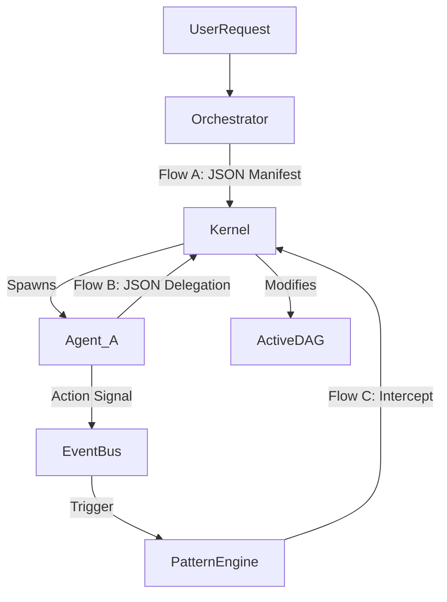

This document outlines the strategic roadmap to transform RARO from a static execution engine into a **Dynamic, Self-Correcting, and Policy-Aware Reasoning Engine**.

This strategy ensures that when we implement the "Kernel Splicer," it is not an isolated feature but a foundational component that supports **Flow A (Auto-DAG)**, **Flow B (Recursive Fork)**, and **Flow C (Safety Patterns)** simultaneously.

---

# RARO Evolution Strategy: The "Living Graph" Architecture

## 1. Architectural Vision
We are moving from a **Pipeline Architecture** (Input $\to$ Process $\to$ Output) to a **Biological Architecture**:
1.  **The Spine (DAG):** Handles the goal-oriented "Happy Path."
2.  **The Nervous System (Event Bus):** Detects signals (errors, tool usage, completion).
3.  **The Cortex (Pattern Engine):** Reacts to signals by modifying the Spine or creating new signals.

### Data Flow Overview

---

## 2. The Implementation Phases

We will execute this in four distinct phases to ensure stability while adding complexity.

### Phase 1: The Linguistic Foundation (Schema & Contract)
*Goal: Ensure Agents, Kernel, and UI speak the exact same language regarding Graph Mutations.*

We cannot implement dynamic logic if the data structures are loose. We will define strict contracts shared across the stack.

*   **1.1 Unified Schema Definition:**
    *   Define `GraphMutation` structs: `AddNode`, `AddEdge`, `RemoveEdge`, `UpdateState`.
    *   Define `DelegationRequest`: A standard wrapper for a list of `GraphMutation`s.
    *   Define `PatternManifest`: JSON structure for defining triggers and actions.
*   **1.2 Syncing Services:**
    *   **Rust (`models.rs`):** Implement Serde structs.
    *   **Python (`main.py`):** Implement Pydantic models.
    *   **TypeScript (`api.ts`):** Implement Interfaces.
*   **1.3 Validation Layer:**
    *   The Agent Service (Python) becomes the "Gatekeeper," ensuring LLM output strictly adheres to these schemas before hitting the Kernel.

### Phase 2: The "Splicer" (Core Kernel Logic)
*Goal: Enable Flow B (Recursive Forking) and Flow A (Auto-DAG).*

This is the most critical logic update. It changes the Kernel from a "List Runner" to a "Graph Manipulator."

*   **2.1 Dynamic DAG Engine (`dag.rs` upgrade):**
    *   Implement `inject_subgraph(parent, new_nodes)`: Handles the topological complexity of inserting nodes mid-stream.
    *   Implement `rewire_dependents(old_parent, new_parents)`: Ensures downstream agents don't run until the *new* sub-agents finish.
*   **2.2 Event-Driven Runtime Loop (`runtime.rs` upgrade):**
    *   Refactor the main execution loop. Instead of iterating a fixed `Vec`, it must poll a `ReadyQueue` that can be modified at runtime.
    *   Handle `DelegationRequest` responses: Pause the calling agent, invoke `inject_subgraph`, and update the `ReadyQueue`.
*   **2.3 Persistence Integration:**
    *   Ensure that when the graph changes, the **new topology** is serialized to Redis immediately. If the server crashes 1 second after a fork, it must wake up knowing about the new nodes.

### Phase 3: The "Nervous System" (Observability & Patterns)
*Goal: Enable Flow C (Safety & Rules) and advanced observability.*

Here we implement the simplified "Atlas" features.

*   **3.1 Internal Event Bus (`events.rs`):**
    *   Create a Tokio broadcast channel inside `RARORuntime`.
    *   Emit events: `NodeStart`, `NodeComplete`, `ToolUsed`, `Error`.
*   **3.2 The Pattern Registry (`registry.rs`):**
    *   A `DashMap` storing active patterns (Safety Guards, Auto-Fixers).
*   **3.3 The Observer Loop:**
    *   A background task that subscribes to the Event Bus.
    *   Evaluates active Patterns against events using a lightweight `PredicateEvaluator` (JSONPath).
    *   Executes Actions (e.g., `InterruptAgent`, `LogWarning`).

### Phase 4: The Interface (Human-in-the-Loop)
*Goal: Make the magic visible and controllable.*

*   **4.1 Live Graph Visualization:**
    *   Update `PipelineStage.svelte` to handle nodes appearing dynamically.
    *   Use D3 or a force-directed logic to re-layout the graph smoothly when it grows.
*   **4.2 The "Approval" Action:**
    *   Implement the UI for the `ForceSync` / `Approval` pattern action. When the system pauses for safety, the UI must show a "Resume/Reject" modal.

---

## 3. Operational Support Checklist

To ensure we support all flows, we will verify the following artifacts at the end of execution:

| Feature | Necessary Artifact | Status |
| :--- | :--- | :--- |
| **Flow A: Auto-DAG** | `OrchestratorPrompt`: Instructions on how to output a root-level `WorkflowManifest`. | ⬜ Pending |
| **Flow B: Recursive** | `WorkerPrompt`: Instructions on when/how to output a `DelegationRequest`. | ⬜ Pending |
| **Flow C: Safety** | `SystemPrompt`: Instructions on converting natural language rules into `PatternManifest` JSON. | ⬜ Pending |
| **Infrastructure** | `RedisRehydration`: Logic to load dynamic sub-nodes from disk on restart. | ⬜ Pending (Partial) |
| **Infrastructure** | `TraceCorrelation`: Ability to see that Agent B was spawned *by* Agent A in logs. | ⬜ Pending |

---
