This is the **Gold Standard** approach for a Hackathon. It is the most impressive because it is fast, stable, and accessible from any browser without the judges needing to install anything.

Here is exactly what the final architecture looks like, followed by the step-by-step instructions to build it.

### 1. The Architecture (Visualized)

When complete, you will have **one IP address** (e.g., `34.72.101.55`) that handles everything.

```mermaid
graph TD
    Judge[👨‍⚖️ Judge's Laptop] -- HTTP/WS (Port 80) --> GCE_VM[☁️ Google Compute Engine VM]
    
    subgraph "Inside the VM (Docker Network)"
        NGINX[nginx Reverse Proxy]
        
        NGINX -- "/" --> Console[svelte-web-console:5173]
        NGINX -- "/api" --> Kernel[rust-kernel:3000]
        NGINX -- "/ws" --> Kernel
        NGINX -- "/agent-api" --> Agents[python-agents:8000]
        
        Kernel -- TCP --> Agents
        Kernel -- TCP --> Redis[redis:6379]
        Agents -- TCP --> Redis
        
        Agents -- TCP --> Puppets[debug-puppet]
        Agents -- TCP --> Probes[debug-probe]
    end
```



---

### 2. Step-by-Step Setup Guide

#### Step A: Provision the Server
1.  Go to **Google Cloud Console** > **Compute Engine**.
2.  **Create Instance**:
    *   **Name:** `raro-hackathon-demo`
    *   **Region:** Choose one close to you (e.g., `us-central1`).
    *   **Machine Type:** `e2-standard-4` (4 vCPU, 16GB RAM). *Don't skimp here; the Python agents and Rust compilation need breathing room.*
    *   **Boot Disk:** Ubuntu 22.04 LTS (x86/64), 50GB Standard Persistent Disk.
    *   **Firewall:** Check **Allow HTTP traffic** and **Allow HTTPS traffic**.
3.  Click **Create**.

#### Step B: Prepare the Environment
1.  Click the **SSH** button next to your new VM in the console.
2.  Run the setup commands (copy-paste these block by block):

```bash
# 1. Update and Install Docker
sudo apt-get update
sudo apt-get install -y ca-certificates curl gnupg lsb-release git
sudo mkdir -p /etc/apt/keyrings
curl -fsSL https://download.docker.com/linux/ubuntu/gpg | sudo gpg --dearmor -o /etc/apt/keyrings/docker.gpg
echo "deb [arch=$(dpkg --print-architecture) signed-by=/etc/apt/keyrings/docker.gpg] https://download.docker.com/linux/ubuntu \
  $(lsb_release -cs) stable" | sudo tee /etc/apt/sources.list.d/docker.list > /dev/null
sudo apt-get update
sudo apt-get install -y docker-ce docker-ce-cli containerd.io docker-compose-plugin

# 2. Clone Your Repo
git clone <YOUR_GITHUB_REPO_URL> raro
cd raro

# 3. Create the Production Environment File
# (Paste your real keys here)
nano .env
```

**Inside `nano .env`, paste:**
```env
GEMINI_API_KEY=your_real_key
E2B_API_KEY=your_real_key
TAVILY_API_KEY=your_real_key
REDIS_URL=redis://redis:6379
# IMPORTANT: This tells the frontend it's running in Docker/Prod
DOCKER_ENV=true 
LOG_LEVEL=INFO
```
*(Press `Ctrl+X`, then `Y`, then `Enter` to save)*

#### Step C: The "Glue" (Nginx Configuration)
We need an `nginx.conf` file to route traffic so you don't have to open 5 different ports on the firewall.

Create the config file in your project root on the server:
```bash
nano nginx.conf
```

**Paste this Nginx Config:**
```nginx
events { worker_connections 1024; }

http {
    server {
        listen 80;

        # 1. Frontend (Svelte) - The Default Route
        location / {
            proxy_pass http://web-console:5173;
            proxy_http_version 1.1;
            proxy_set_header Upgrade $http_upgrade;
            proxy_set_header Connection "upgrade";
            proxy_set_header Host $host;
        }

        # 2. Kernel API (Rust)
        location /api/ {
            # Strip the /api prefix before sending to Kernel
            rewrite ^/api/(.*) /$1 break;
            proxy_pass http://kernel:3000;
            proxy_set_header Host $host;
        }

        # 3. Kernel WebSockets (Real-time logs)
        location /ws/ {
            proxy_pass http://kernel:3000;
            proxy_http_version 1.1;
            proxy_set_header Upgrade $http_upgrade;
            proxy_set_header Connection "upgrade";
            proxy_set_header Host $host;
        }

        # 4. Agent API (For Architect planning calls from frontend)
        location /agent-api/ {
            rewrite ^/agent-api/(.*) /$1 break;
            proxy_pass http://agents:8000;
            proxy_set_header Host $host;
        }
        
        # 5. Debug Puppet (Optional)
        location /puppet/ {
            proxy_pass http://puppet-master:8081/;
        }
    }
}
```

#### Step D: Update Docker Compose
You need to add the Nginx container to your `docker-compose.yml`.

Edit your compose file: `nano docker-compose.yml`

Ensure it looks roughly like this (focusing on the **Nginx** service and **Networks**):

```yaml
version: '3.8'

services:
  # ... (redis, kernel, agents, etc. stay the same) ...

  web-console:
    build: 
      context: ./apps/web-console
      dockerfile: Dockerfile
    # IMPORTANT: Remove ports mapping here, Nginx handles it
    # ports: 
    #   - "5173:5173" 
    environment:
      - VITE_USE_MOCK_API=false # Ensure we use real backend
    depends_on:
      - kernel

  # ... (other services) ...

  # THE REVERSE PROXY
  nginx:
    image: nginx:alpine
    ports:
      - "80:80" # Maps VM port 80 to Container port 80
    volumes:
      - ./nginx.conf:/etc/nginx/nginx.conf:ro
    depends_on:
      - web-console
      - kernel
      - agents

# Ensure all services share the default network
```

#### Step E: Launch
Run this command to build and start everything in the background:

```bash
sudo docker compose up -d --build
```

*Note: This will take 3-5 minutes the first time to compile the Rust kernel and build the Python images.*

---

### 3. How to Present to Judges

Once `docker compose logs -f` shows everything is running and the Kernel says "Listening on 0.0.0.0:3000":

1.  **Get your External IP:**
    In the Google Cloud Console, look at the **External IP** column for your instance. (e.g., `34.123.45.67`).

2.  **The Link:**
    You simply send the judges this link:
    > **`http://34.123.45.67`**

3.  **The Experience:**
    *   They open the link.
    *   They see the **Hero.svelte** boot sequence ("MONOLITH LOADING...").
    *   They click "BOOT SYSTEM".
    *   They are dropped into the console.
    *   They type a prompt.
    *   **Magic:** It works instantly. No "npm install", no "cargo run".

### 4. Why this wins Hackathons

1.  **No "It works on my machine":** It is running on a production-grade Linux server.
2.  **Persistence:** If a judge refreshes the page, the Redis state (persisted in Docker) keeps the history.
3.  **Real-Time:** Because the Frontend and Kernel are on the same internal Docker network, latency is near zero.
4.  **Professionalism:** Using a Reverse Proxy (Nginx) shows architectural maturity.

### Troubleshooting (Cheat Sheet)

*   **"Site can't be reached":** Check GCE Firewall rules. Ensure "HTTP / Port 80" is allowed.
*   **"WebSocket Error":** Check the Nginx config for the `Upgrade` headers in the `/ws/` block.
*   **Logs:** `sudo docker compose logs -f kernel` (or `web-console`, `agents`) to see what's happening inside.
*   **Fixing Code:** Edit files locally, push to git, then on the server: `git pull && sudo docker compose up -d --build web-console` (rebuilds just the changed service).